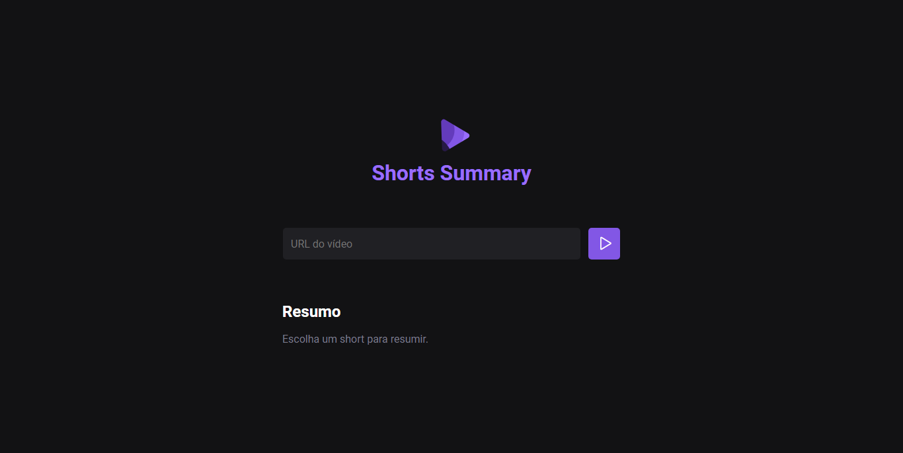

<h1 align="center"> Shorts Summary </h1>

Resumidor de shorts com Ia 

  <a href="#-tecnologias">Tecnologias</a>&nbsp;&nbsp;&nbsp;|&nbsp;&nbsp;&nbsp;
  <a href="#-projeto">Projeto</a>&nbsp;&nbsp;&nbsp;|&nbsp;&nbsp;&nbsp;
  <a href="#-layout">Layout</a>

 

  

## 🎓 Tecnologias

Esse projeto foi desenvolvido com as seguintes tecnologias:

- HTML e CSS
- JavaScript
- Git e Github
- Figma

## 📔 Projeto

Ao enviar um link de um shorts, a Ia Xenova resumirá o conteúdo do vídeo, ou pelo menos, tentará 🤭  
Toda bugadinha coitada. Demanda tempo e paciência!

Não roda sem "npm run server"!

- [Visite o projeto online](https://isaluh.github.io/nlwIa/)

## 🏯 Layout

Visualise o layout do projeto através [desse link](https://www.figma.com/community/file/1282823495335498952/Shorts-Summary-%E2%80%A2-Trilha-Foundations). É necessário ter conta no [Figma](https://figma.com) para acessá-lo.

---

<h4 align="center">By: Isaluh - feat: Rocketseat 🤍</h4>